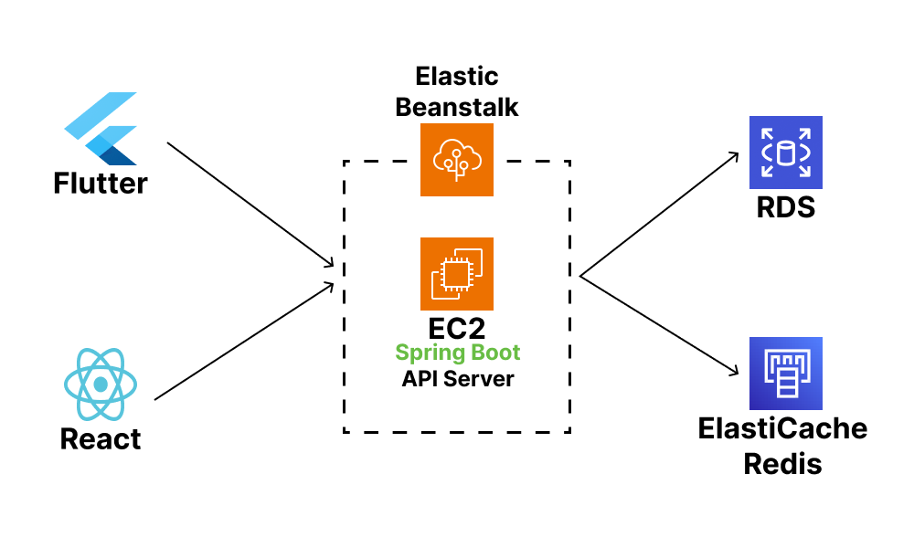
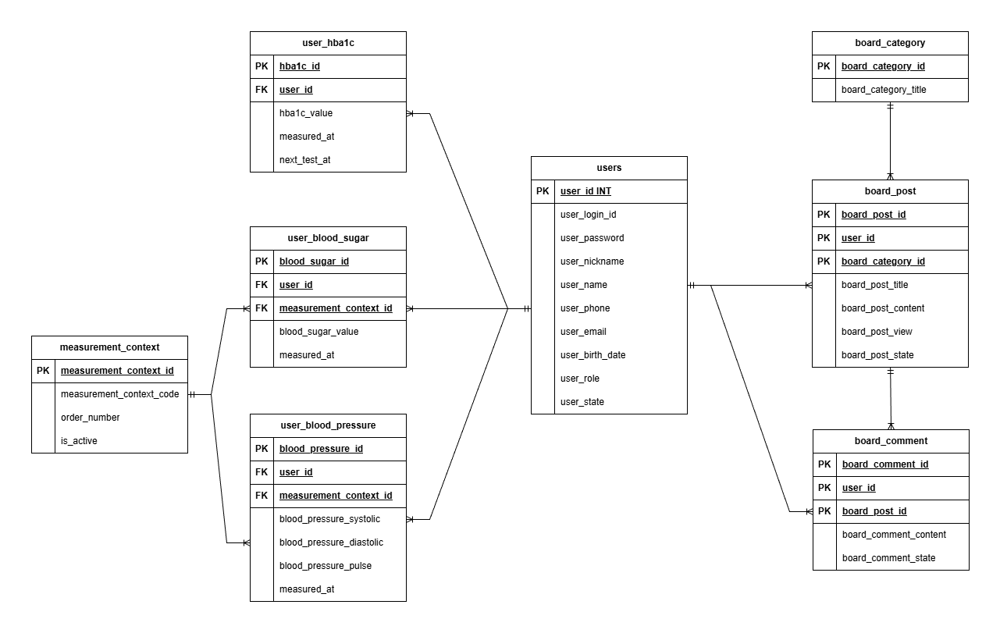
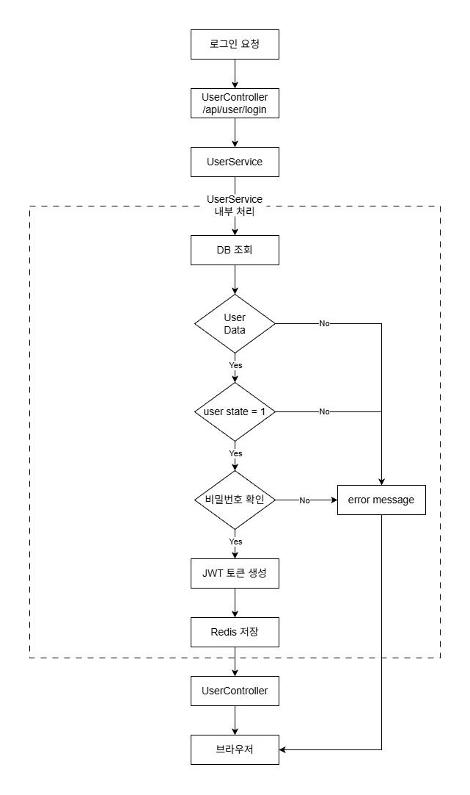

<h2>📝 프로젝트 소개</h2>

    

        BloodMate(블러드메이트)는 혈당·혈압을 편하게 기록하고 확인할 수 있는 건강 관리 서비스입니다.
    

<h2>기획 의도</h2>

    

        점점 기대 수명은 늘어나며 당뇨병 환자가 증가하고 있으며 젊은 층의 당뇨병 환자 또한 꾸준히 증가하고 있습니다.
    

    

        이에 대한민국은 방송미디어통신위원회 보도자료에 따르면 2023년 스마트폰 보급률94.8%로 많은 사람들이 스마트폰을 사용하는 환경이기 때문에, 종이에 기록하는 대신 스마트폰에
        건강 데이터를 저장하고 관리할 수 있는 서비스가 필요하다고 판단했습니다.
    

    

        이에 따라 혈당·혈압을 손쉽게 기록하고 관리할 수 있는 BloodMate서비스를 기획하게 되었습니다.
    

    

    

        점점 기대 수명이 늘어나면서 당뇨병 환자가 증가하고 있으며, 특히 젊은 층의 당뇨병 환자 또한 꾸준히 증가하고 있습니다.
    

    

        이에 방송미디어통신위원회 보도자료에 따르면, 2023년 대한민국의 스마트폰 보급률은 94.8%로 대부분의 국민이 스마트폰을 사용하고 있습니다.
        이러한 환경을 생각했을 때, 종이에 기록하는 방식보다 스마트폰을 활용하여 건강 데이터를 저장하고 체계적으로 관리할 수 있는 서비스가 필요하다고 느꼈습니다.
    

    

        이에 따라 혈당·혈압을 손쉽게 기록하고 확인할 수 있는 건강 관리 서비스 BloodMate를 기획하게 되었습니다.
    

<h2>📅 개발 기간</h2>
<ul>
    <li><strong>2025.08.28 ~ 2025.11.02</strong></li>
</ul>

<h2>💻 개발 환경</h2>
<ul> <!-- valign="middle"  -->
    <!-- FrontEnd -->
    <li>
        

            FrontEnd : 
            <!-- React -->
            &nbsp
            <!-- Flutter -->
            &nbsp
        

    </li>
    <!-- BackEnd -->
    <li>
        

            BackEnd : 
            <!-- Spring Boot -->
            &nbsp
            <!-- JPA -->
            &nbsp
            <!-- JWT -->
            &nbsp
        

    </li>
    <!-- DataBase -->
    <li>
        

            DataBase & Cache : 
            <!-- MySQL -->
            &nbsp
            <!-- Redis -->
            &nbsp
        

    </li>
    <!-- IDE -->
    <li>
        

            IDE : 
            <!-- IntelliJ IDEA -->
            &nbsp
            <!-- Android Studio -->
            &nbsp
            <!-- Visual Studio Code -->
            &nbsp
        

    </li>
    <li>
        

            기획서 & 일정 관리 : 
            <!-- Google Sheets -->
            &nbsp
        

    </li>
</ul>

<h2>📌 시스템 아키텍처</h2>

    

<h2>📌 ERD</h2>

    

<h2>📌 주요 기능</h2>

    <!-- 사용자 인증 -->
    <ul>
        <li><strong>사용자 인증</strong></li>
        <ul>
            <li>JWT 기반 로그인/로그아웃</li>
            <li>Redis를 활용한 토큰 관리 및 중복 로그인 방지</li>
        </ul>
    </ul>
    <!-- HBA1C/혈당/혈압 기록 관리 -->
    <ul>
        <li><strong>HBA1C/혈당/혈압 기록 관리</strong></li>
        <ul>
            <li>CRUD API 설계</li>
            <li>아침/점심/저녁/운동 전후등 측정 상황 분류</li>
        </ul>
    </ul>
    <!-- 대시보드 -->
    <ul>
        <li><strong>대시보드</strong></li>
        <ul>
            <li>측정 상황에 따라 최근 측정 값, 평균/최소/최대 값 조회 API</li>
            <li>최근 공지 게시물 출력</li>
        </ul>    
    </ul>
    <!-- 게시물 -->
    <ul>
        <li><strong>게시물</strong></li>
        <ul>
            <li>공지/자유/혈당/혈압 등 카테고리별 게시글 관리 API</li>
            <li>노령 사용자를 위한 버튼식 게시물 Read</li>
        </ul>
    </ul>

<h2>📄 API 명세서 링크</h2>

    <ul>
        <li><a href = "https://docs.google.com/spreadsheets/d/1nBB3n0IDq4Q279cRKUsHXq7Vx3-87kCgiR5TozAW9jU/edit?usp=sharing">유저 API</a></li>
        <li><a href = "https://docs.google.com/spreadsheets/d/12yweGDiE5MyfbDJZonCAdnQoCdKIv9XYYLJeeE0uE3Q/edit?usp=sharing">건강 관리 API</a></li>
        <li><a href = "https://docs.google.com/spreadsheets/d/1LWNvnNnLxAFr-eTLRAIf70kQPwLhPP4FFKgIdQJM2FU/edit?usp=sharing">게시물 API</a></li>
    </ul>

<h2>🔁 로그인 플로우 차트</h2>

    

<h2>🚀 개선 계획</h2>

    <ul>
        <li>JWT Access Token을 LocalStorage 대신 HttpOnly 쿠키로 전송·관리하도록 개선</li>
        <li>아이디/비밀번호 찾기 인증코드를 문자 API에 적용</li>
        <li>건강 데이터 여러 조건 검색 기능 적용</li>
        <li>건강 데이터 차트 적용</li>
        <li>앱 설정 기능 적용</li>
        <li>게시판 이미지 저장 기능 적용</li>
        <li>관리자 페이지 및 관리자 전용 API 구현</li>
        <li>건강 데이터 문서화 API 구현</li>
    </ul>

<h2>🧠 회고(KPT)</h2>

    <!-- KEEP -->
    <ul>
        <li>KEEP</li>
        <ul>
            <li>JWT와 Redis를 활용하여 사용자의 인증 상태를 효율적으로 관리할 수 있었습니다.</li>
            <li>Java Security를 이용해 랜덤 인증번호를 생성함으로써 인증 로직의 기본 구조를 직접 구현해볼 수 있었습니다.</li>
        </ul>
    </ul>
    <!-- PROBLEM -->
    <ul>
        <li>PROBLEM</li>
        <ul>
            <li>Redis를 단순히 로그인 토큰 관리 용도로만 사용하여 웹·앱 간 동시 로그인 문제를 해결하지 못했습니다.</li>
            <li>랜덤 인증번호를 실제 메일 또는 문자 전송 API와 연동하지 못해 인증 시스템이 완전하지 않았습니다.</li>
            <li>사용자의 건강 데이터만을 중심으로 개발하다 보니 게시판에서의 관리자의 역할을 고려하지 못했습니다.</li>
        </ul>
    </ul>
    <!-- TRY -->
    <ul>
        <li>TRY</li>
        <ul>
            <li>Redis를 활용해 웹과 앱간의 동시 로그인 제어 및 관리자 전용 기능을 구현해보겠습니다.</li>
            <li>문자 또는 메일 API를 연동하여 실제 서비스 환경과 유사한 인증번호 검증 시스템을 구축하겠습니다.</li>
            <li>새로운 기능을 만들 때마다 관리자 입장에서 필요한 기능이 있는지 고민하며 실제 서비스처럼 완성도 있는 프로젝트를 개발하도록 하겠습니다.</li>
        </ul>
    </ul>

